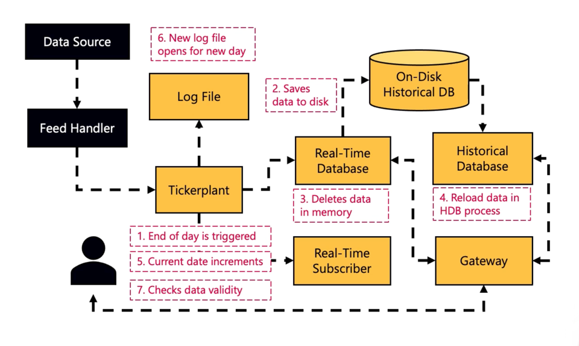
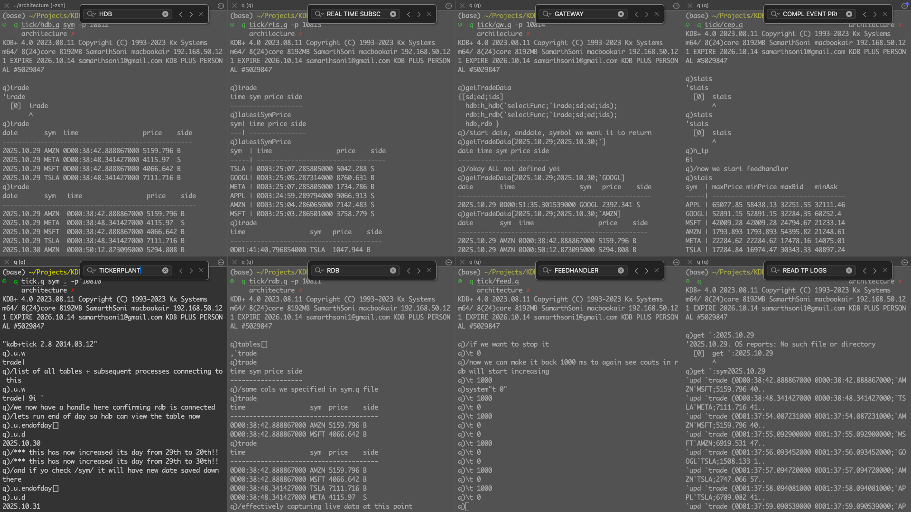

# qKiln – Architecture Sandbox

This repository imports the architecture baseline from the KX Academy GitHub repository (original repo: https://github.com/KxSystems/kdb-architecture-course).  
The content is imported for local experimentation and modification under the `architecture/` directory; original commit history is *not* merged (squashed) to keep this repo’s history clean.  
Special thanks to Michaela Woods and the KX Academy team for creating and sharing the foundational architecture work.

# Brief Introduction

This repo contains sample **kdb+ architecture** for building a kdb+ application for capturing real time streaming data. This repo accompanies the online training course on the [KX Academy](https://learninghub.kx.com/courses/kdb-architecture/). 

## Prerequisites

- If you run this application using the free sandbox provided on the KX Academy - then there are no prerequisites needed.
- If you clone this repository to your local environment, you will need to have kdb+ installed with a valid license and the `q` alias set to invoke kdb+ as per [these instructions](https://code.kx.com/q/learn/install/#step-5-edit-your-profile).

## 1. Quickstart
```
q tick.q sym . -p 10810
q tick/rdb.q -p 10811
q tick/feed.q /(or run manual steps)
q tick/hdb.q sym -p 10812 
q tick/rts.q -p 10813 
q tick/gw.q -p 10814

// more functionalities 
q tick/cep.q
```

## 2. Adding Data Feed
To add a new data feed you will need to adjust two files: `sym.q` and `feed.q`.

### Add new table schema in sym.q
Define another schema for the `quote` table.
```
quote:([]time:`timespan$();sym:`g#`symbol$();bid:`float$();ask:`float$();bsize:`int$();asize:`int$());
```

### Adjust .z.ts to add a second table in feed.q

Replace:
```
.z.ts:{h_tp"(.u.upd[`trade;(2#.z.n;2?`APPL`MSFT`AMZN`GOOGL`TSLA`META;2?10000f;2?`B`S)])"};
```
With:
```
.z.ts:{h_tp"(.u.upd[`trade;(2#.z.n;2?`APPL`MSFT`AMZN`GOOGL`TSLA`META;2?10000f;2?`B`S)])";
      h_tp"(.u.upd[`quote;(2#.z.n;2?`APPL`MSFT`AMZN`GOOGL`TSLA`META;2?10000f;2?10000f;2?500i;2?500i)])"};
```       
Launch the feedhandler:
```
q tick/feed.q
```

## 3. Real Time Subscriber
```
q tick/cep.q
```

## 4. Logging & Replay 

## 5. End of Day
Illustrated Tick Architecture with example EOD savedown steps. Credits: KX Academy


Custom EOD Functionalities:
- Change data on disk format, some tables partitioned, some splayed, some flat
- Multiple RDBs, one writes data to disk, one still servers user queries. Gateway can abstract out so users dont worry
- Email notificaitons - "EOD complete, data successfully written to disk without issues" - notify of any interruptions
- data quality checks - separate process to connect to HDB, read persisted data, check if good
  - price drop unusually/gaps in market data/etc.?
  - flag to users in email report - issue with data or upstream etc
- handle backfills - if tp needs to load historical CSVs, then it can be adjusted so the data is appended historically when write down
  - basically handle older dates, ensure not to overwrite
  - with this tp and eod can handle fresh data + older dates
- Intraday writedown -- in case hitting memroy issues
  - highly configurable: write data every X hours or every Y rows
  - New "intraday database" process which also connects to HDB and gateway
  - whitepaper "intraday writedown solutions"

## 6. Gateways
Adjust `getTradeData` in gw.q.
Replace:
```
getTradeData:{[sd;ed;ids]
  hdb:h_hdb(`selectFunc;`trade;sd;ed;ids);
  rdb:h_rdb(`selectFunc;`trade;sd;ed;ids);
  :hdb.rdb }
```
With:
```
getTradeData:{[sd;ed;ids]
  hdb:h_hdb(`selectFunc;`trade;sd;ed;ids);
  rdb:h_rdb(`selectFunc;`trade;sd;ed;ids);
  :select from hdb,rdb where time = (max;time) fby([]date;sym) }
```
Launch gateway
```
q tick/gw.q -p 5014 
```
And query `getTradeData` from the gateway.
```
getTradeData[.z.D-1; .z.D;`APPL] 
```


## TUTORIAL
**Logs and examples of how to run each and what outputs to expect are logged in [runprocesstutorial.q](runprocesstutorial.q)**


 
>iTerm was used for easy splitting/management of multiple terminals in a single window

Future work:
- See how to rename the database folder from sym/ to something like hdb/
- Currently, whenever .u.endofday[] is run from tickerplant, whatver is in rdb is overwritten onto the hdb. So, either find a way to load the currently present data on disk into rdb, OR implement check while savedown to ensure append write, NOT OVERWRITE
- also, after tickerplant has ran endofday, realtimesubscriber is still stuck with its data of the previous day. See why, and how can this be corrected so rte also refreshes like rdb does
- CEP is ADDING the new maxprice to the old maxprice surrently saved in the table. This is obviously wrong. Fix this.